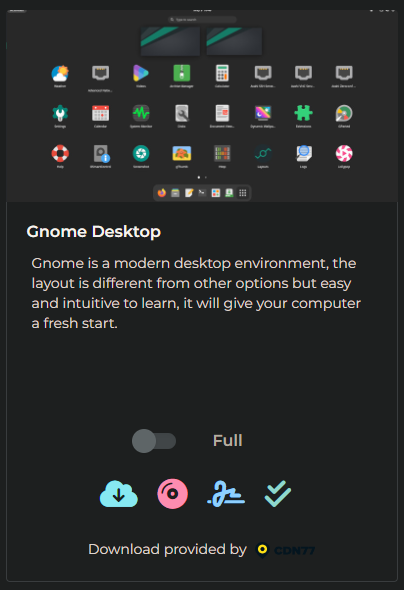
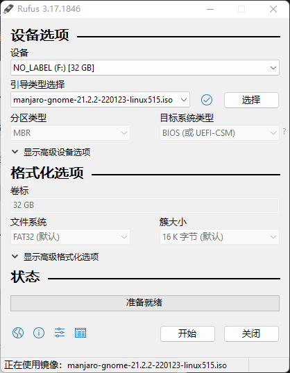
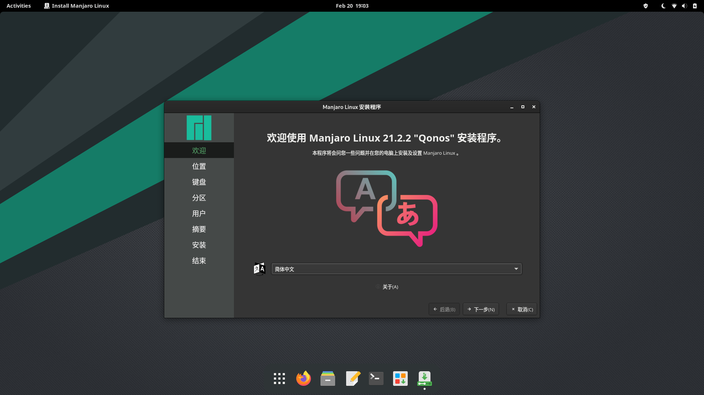
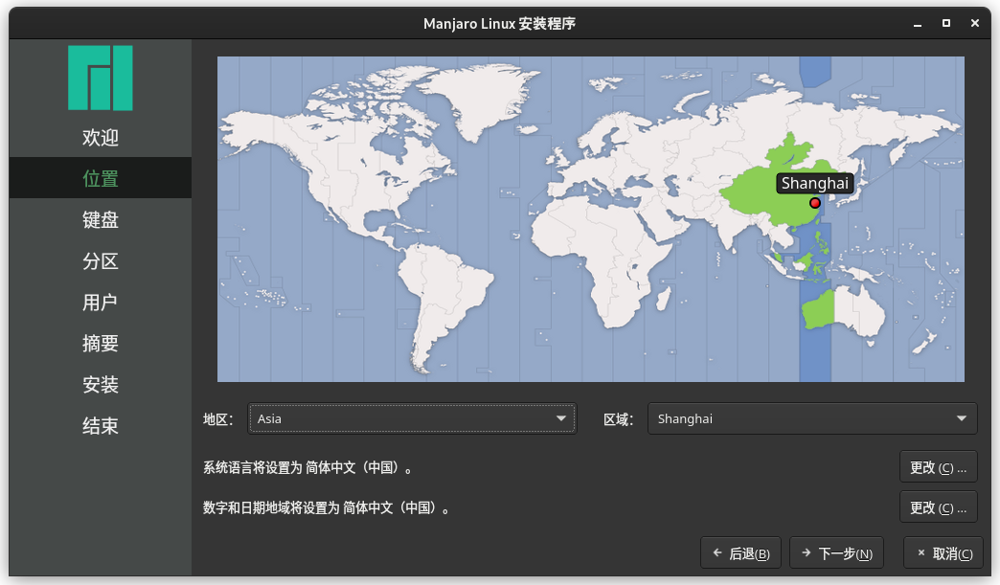
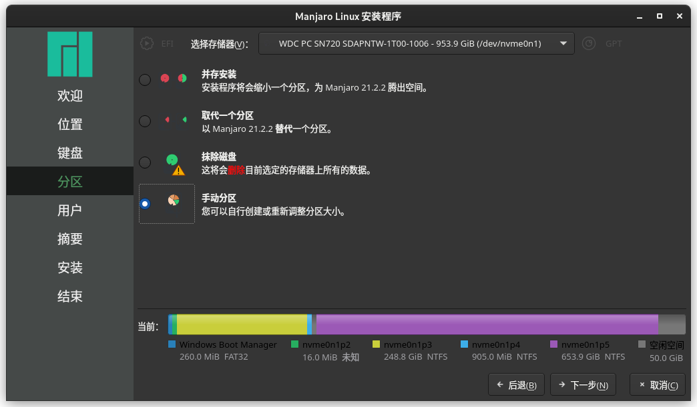
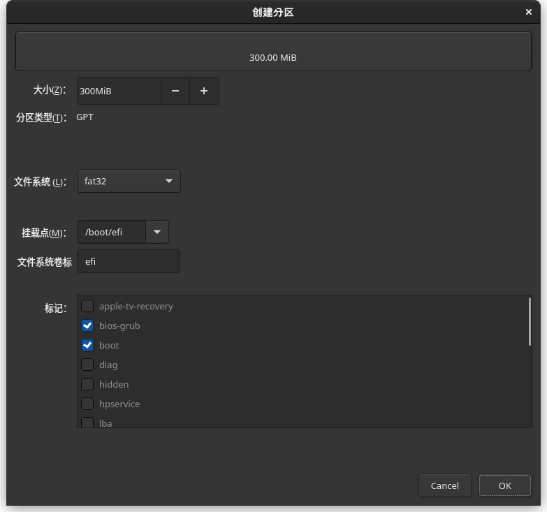
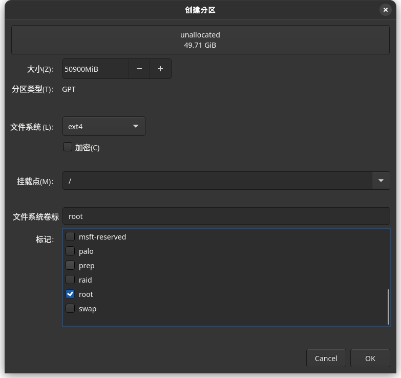
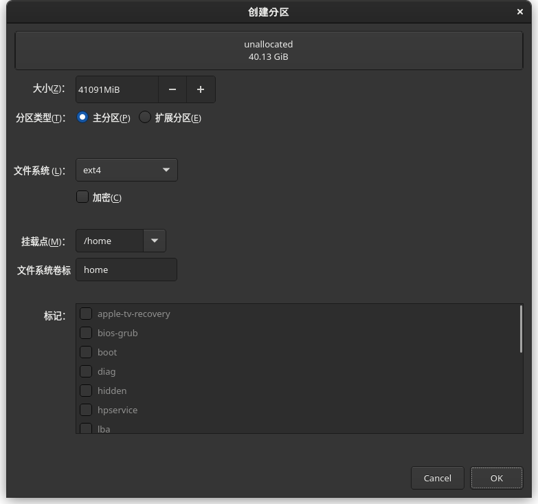
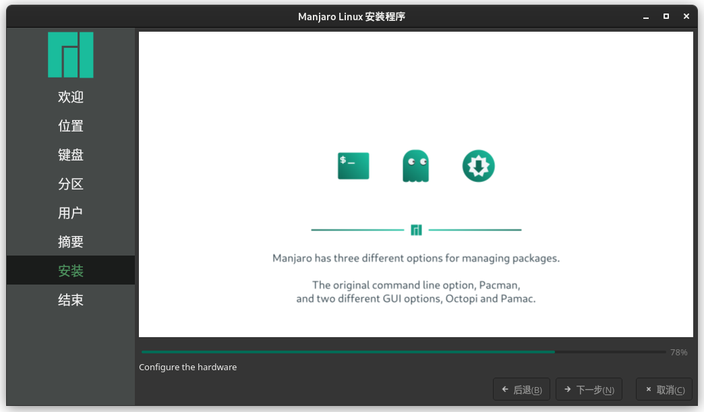
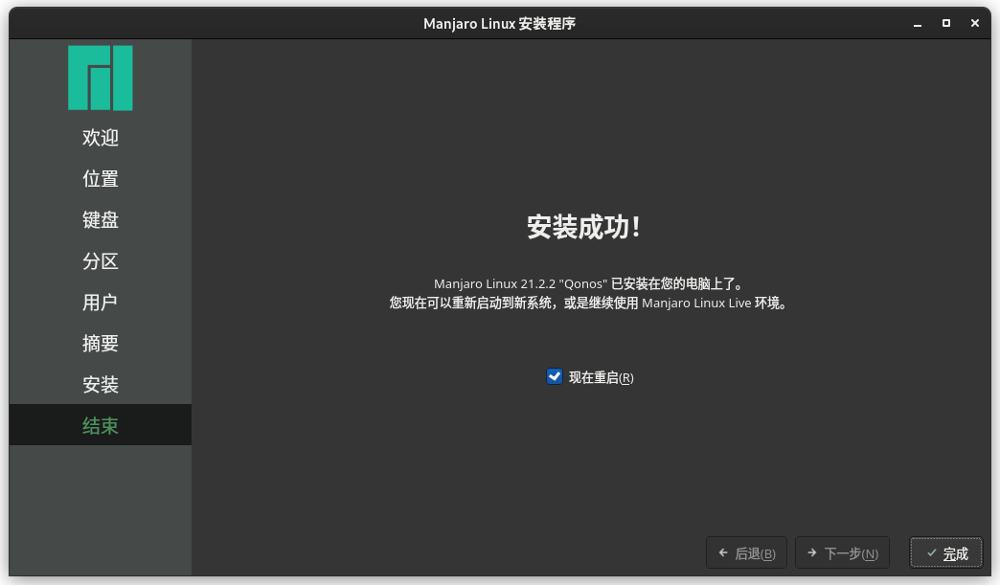

# 安装

在硬盘的指定位置安装 Manjaro, 适用于普通用户/多系统用户/SSD与HDD混合的用户.  

## 条件

- U盘: 将被格式化, 因此应先转移U盘内已有的数据.

## 梗概

1. 制作 Manjaro 的 USB 启动盘.
2. 利用 Manjaro 自带的安装程序安装 Manjaro 到硬盘.

## 下载镜像

从[官网](https://manjaro.org/download/)下载系统镜像.  
  
默认是 `Full` 完整版, 也可以选择 `Minimal` 最小版, 仅提供了基本的桌面环境, 没有安装附加的软件.  
点击红色按钮 `Download Full Image` 直接下载镜像文件, 点击青色的 `Download Full Torrent` 下载种子文件.  

若使用种子下载需使用专门的下载器进行下载.  
  

## 下载烧录软件

从[官网](http://rufus.ie/zh/)下载软件.  
  

!!! info
    该软件无需安装.  

!!! warning
    自动更新可能失效, 新的系统镜像使用较早版本的 Rufus 可能导致失败, 因此建议从官网下载最新版本.  

## 烧录镜像到U盘中

1. 插入U盘.
2. 选项设置可参考下图.  
     
3. 点击 `开始` 按钮.

Rufus 快速格式化U盘并开始写入镜像, 耗时大约 3-5 min.  

## 从U盘中启动

开机时按下指定按键进入 BIOS 设置, 然后选择从U盘启动.  
**提示**: 不同电脑进入 BIOS 设置的方式和从U盘启动的操作不同, 需更具自己的电脑型号查找具体操作方式.  
**注意**: 修改前需拍照备份, 方便失败后复原.  

## [更新 pacman 镜像源](../Arch_包管理.md#更新镜像源)

后续安装将使用到 pacman 下载内容, 因此提前更新镜像源可以提高安装速度和成功率.

## 安装 Manjaro

启动后单击任务栏最右侧的图标启动 Manjaro 安装程序.  

### 欢迎

  

### 位置

选择时区和系统语言.
  

### 键盘

选择键盘布局.  

!!! warning
    `Chinese(汉语)` 键盘布局可能存在问题.  

  

### 分区

选择手动分区.  
  

根据硬盘类型和空间进行分区. 在进行分区时, 应该先对 [FHS] 具有基本了解.  
  
  
  
  
  

### 用户

设置用户名/计算机名/密码.  

### 安装

点击 `安装` 开始在指定分区安装 Manjaro.  
**注意**: `misc postinstall configurations` 步骤需要调用 pacman 下载内容, 因此可能耗时较长.  
  

### 结束

系统成功安装后将显示此提示.
  

## 安装后配置

- [包管理](../Arch_包管理.md)
- 时间同步: 在设置中开启时间同步, 如果是双系统请查看[双系统时间不同步](../双系统时间不正确.md).
- 启用备份: 使用 Timeshift 对系统进行定期备份.

## 拓展

- [Manjaro Wiki](https://wiki.manjaro.org/index.php/Main_Page)

[FHS]: https://refspecs.linuxfoundation.org/FHS_3.0/index.html
