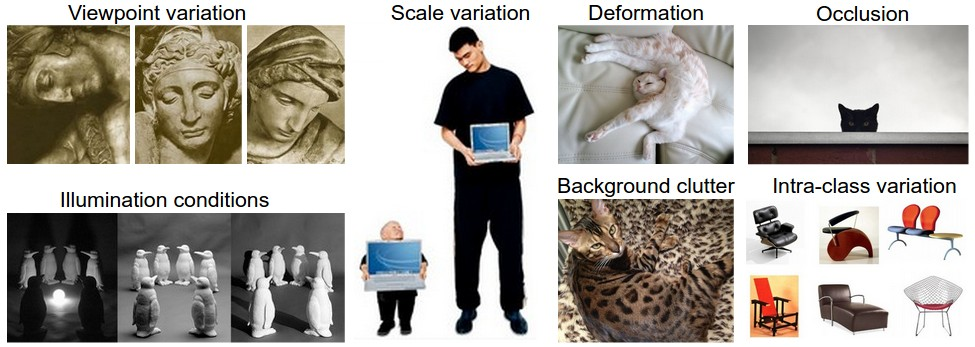

# 图像分类(Image Classification)

## 概述

图像分类是计算机视觉的一个核心任务.  

### 挑战

该任务主对于人类来说十分简单, 这些工作会在大脑中自动完成. 但是对于计算机却十分困难, 因为
主要有以下挑战:  

  

- 视口变换(Viewport variation): 物体可能从多个观察角度被观察.
- 缩放变换(Scale variation): 物体大小可能发生缩放. (指的是现实中的大小, 而不是图像中的)
- 变形(Deformation): 物体可能存在多种姿态.
- 遮挡(Occlusion): 物体的部分可能被其他物体遮挡.
- 光照条件(Illumination conditions): 物体可能处在在不同光照条件下.
- 背景杂乱(Background clutter): 物品可能处在一个十分杂乱的背景下.
- 不同变种(Intra-class variation): 物体可能存在多种变种.

一个物体的图像可能存在以上几种情况, 但都是同一个物体的图像. 因此算法要有足够的鲁棒性才能正确识别这些图像.  

### 数据驱动方法(Data-driven Approach)

## Nearest Neighbor Classifier

计算单个像素之间的差值的绝对值并求和.  
该算法的实现十分简单, 本质上就是两个矩阵求差取平均值后求所有元素之和.  
缺点也十分明显, 每分类一张图像就需要遍历整个数据集因此效率十分低下. 且因为判断方式过于简单, 精度也很低.  

## K-Nearest Neighbors Classifier

## 参考

- <https://cs231n.github.io/classification/>
