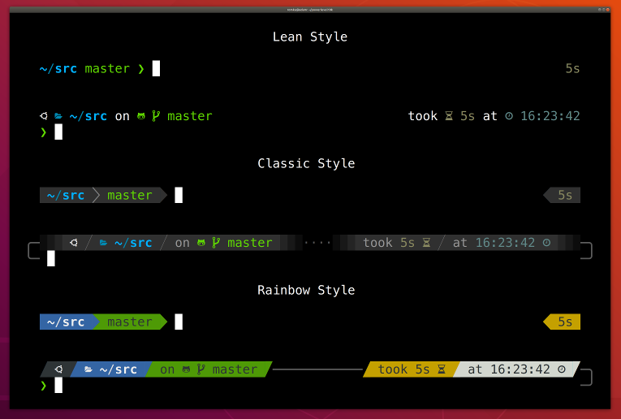

# Shell

!!! warning
    异常的 Shell 配置, 如对 `.zshrc` 的错误修改可能导致终端模拟器无法启动. 因此配置完后因开启新的终端模拟器来进行测试, 而不是直接将新配置应用到当前终端.  

## 基础命令增强

基础命令 ls, grep, find, cat, top 等都有更快/更美观/更实用的增强版本.  
安装这些增强的版本可以提高效率, 详情请查看[常用软件](常用软件.md#terminal).  
安装后在 `.zshrc` 中创建别名, 用增强版替代原命令, 如:  

```sh
alias ls='exa' # 将 ls 作为 exa 的别名
```

## 安装 Powerline 字体

该字体包含了大量图标, 可以用于显示美观的 Prompt/Vim/Tmux 状态栏.  
可以从 [Nerd Fonts](https://www.nerdfonts.com/) 下载字体, 包含了 Powerline 和其他流行图标.  

如倾向使用 `Cascadia Code` 的话可以下载 `Caskaydia Cove Nerd Font`, 包含了 `Cascadia Code` 字体, Powerline 和其他流行图标.  

{ width=70% style="display: block; margin: 0 auto" }    

## 命令提示符

默认的命令提示符通常只提供了最基本的信息, 如当前所在的目录.  
通过自定义命令提示符可以向用户提供更多有用的信息, 如: 上一条命令的返回值, 当前目录的 Git 状态等.  

[powerlevel10k](https://github.com/romkatv/powerlevel10k.git) 是一个开箱即用的 Zsh 主题, 可以快速的配置一个实用美观的命令行提示符.  

{ width=70% style="display: block; margin: 0 auto" }    

```sh
git clone --depth=1 https://github.com/romkatv/powerlevel10k.git ~/powerlevel10k
echo 'source ~/powerlevel10k/powerlevel10k.zsh-theme' >>~/.zshrc
source ~/.zshrc
p10k configure
```

## 终端复用

在进一步了解 Tmux 的使用前需要先了解几个[术语](https://github.com/tmux/tmux/wiki/Getting-Started#summary-of-terms).  
Tmux 允许用户创建多个**会话(Session)**, 每个会话可以有多个**窗口(Window)**, 每个窗口可以有多个**面板(Pane)**.  

[gpakosz/.tmux](https://github.com/gpakosz/.tmux) 是一个开箱即用的 Tmux 配置, 可以快速的配置一个实用美观的 Tmux 环境.  
用户只需修改配置文件 `.tmux.conf.local`.  

```sh
git clone --depth=1 https://github.com/gpakosz/.tmux.git ~/.tmux
ln -s -f ~/.tmux/.tmux.conf
cp ~/.tmux/.tmux.conf.local ~
```

终端启动时自动进入 Tmux 会话可以在 `.zshrc` 的开头添加以下内容:  

```sh
if command -v tmux &> /dev/null && [ -n "$PS1" ] && [[ ! "$TERM" =~ screen ]] && [[ ! "$TERM" =~ tmux ]] && [ -z "$TMUX" ]; then
  exec tmux new-session -A -s main
fi
```

## 命令别名

为常用的命令取一个简短的别名可以提高效率, 如:  

```sh
alias ll='ls -l'
alias lg='lazygit'
```

## 环境变量

### 默认编辑器

设置默认编辑器为 Neovim:  

```sh
export VISUAL=nvim
export EDITOR=nvim
```

### 网络代理

设置HTTP/HTTPS网络代理服务器为 `<IP>:<PORT>`.  

```sh
set HTTP_PROXY=<IP>:<PORT>
set HTTPS_PROXY=<IP>:<PORT>
```
