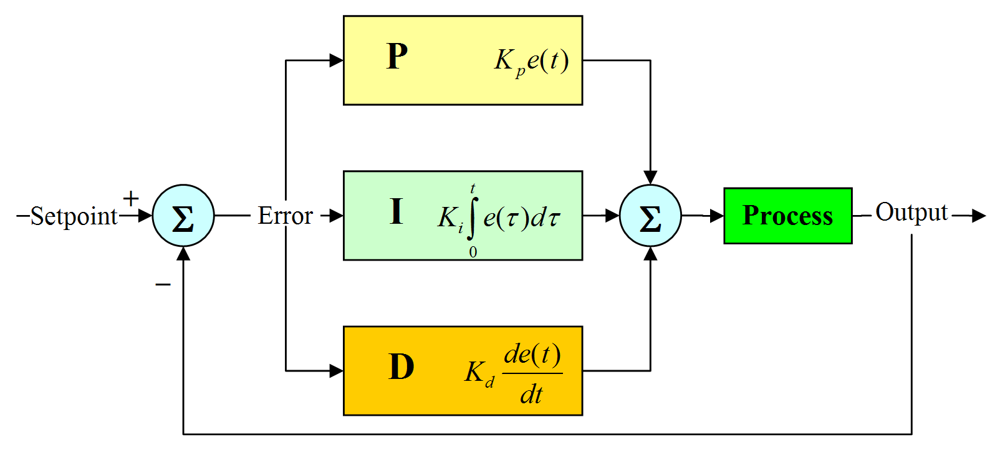
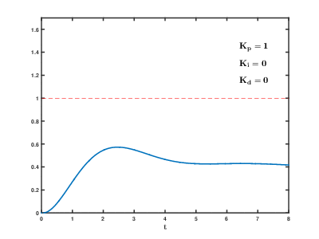

# PID 控制算法

在现实中对事物的控制不能达到完全精确. 如果使用开环的控制系统将导致误差不断积累, 最终达到某个阈值, 失去对事物的控制. 利用 PID 来构建一个闭环控制系统, 可以自动调节输出接近设定的目标值.  

该算法由三部分组成, 分别是比例(Proportional, P)单元, 积分(Integral, I)单元和微分(Derivative, D)单元.  

  

注解:

- Kp: 比例调节参数.
- Ki: 积分调节参数.
- Kd: 微分调节参数.
- e(t): 当前误差.

## 稳态误差(Steady-State Errors)

系统从一个稳态过渡到新的稳态, 或系统受扰动作用又重新平衡后, 系统出现的偏差.  

## 参数

- P: 比例单元.

    结果为误差与 Kp 的乘积. 误差越大调节力度越大, 快速减小误差; 误差越小调节力度越小.  

- I: 积分单元.

    结果为积分与 Ki 的乘积. 积分为误差与时间的乘积之和, 因此考虑到了不同时间段的误差. 若误差长期没有得到修正, 存在稳态误差, 积分会不断增加, 最终会使误差会不断接近零.  

- D: 微分单元.

通过下图可以直观的看出三种参数对整体调节效果的影响:  



## 调节参数

三个公式都包含各自的调节参数, 这三个调节参数分别控制三个部分计算的结果对控制的影响大小, 应更具实际应用将它们调整到最适合的值.  
调试 PID 控制参数主要方式有:

- 人工调整.
- [齐格勒-尼科尔斯方法](https://zh.wikipedia.org/wiki/齐格勒－尼科尔斯方法).
- PID 调试软件.

## 实现

```cpp
float kP, kI, kD;     // 这三个参数的值由用户指定
float target, output; // target 为期望达到的值
float p, i = 0.0f, d, error, lastError;
auto  previous = getCurrentMillSecond();
while(true)
{
  auto     current = getCurrentMillSecond();
  uint16_t dt      = static_cast<uint16_t>(current - previous);
  previous         = current;

  error     = target - output;
  lastError = error;

  p  = kP * error;
  i += kI * error * dt;
  d  = kD * (error - lastError) / dt;

  output = p + i + d; // 产生输出
}
```

## 参考

- <https://zh.wikipedia.org/wiki/PID控制器>
- <https://www.bilibili.com/video/BV1jr4y1P7qK/?spm_id_from=333.788.recommend_more_video.0>
