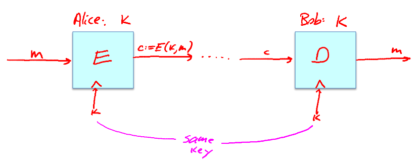

# 对称密码

**英文**: Symmetics ciphers.

特点是使用相同的密钥K.  

一致性方程: D(k, E(k, m)) = m.  

## 一次性密码本(The one time pad)

$$E(k, m) = k \oplus m $$
$$ D(k, c) = k \oplus c $$

一致性方程:
$$ D(k, E(k, m)) = k \oplus (k \oplus m) = (k \oplus k) \oplus m = 0 \oplus m = m $$

密钥 k 的长度和明文相等.  

## 完美密码

密文不应该揭露任何明文的信息.  

$$ \forall m_0, m_1 \in \cal{M} (|m_0| = |m_1|) \, and \, \forall c \in \cal{C} $$
$$ P_r[E(k, m_0) = c] = P_r[E(k, m_1) = c] \, where \, k \underleftarrow{R} \cal{K} $$