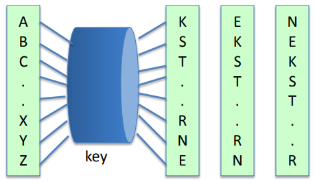

# 概述

密码学(Cryptography)包含以下两部分:

- 密码编码学(Cryptologhy): 研究密码体制(Cryptosystem).
- 密码分析学(Cryptanalysis): 研究/破译密码.

## 密码编码学

密码系统(密钥体制)通常由以下五部分组成:  

1. 消息空间: 所有可能明文的有限集, 通常用 $\cal{M}$ 表示.
2. 密文空间: 所有可能密文的有限集, 通常用 $\cal{C}$ 表示.
3. 密钥空间: 所有可能密钥的有限集, 通常用 $\cal{K}$ 表示.
4. 加密算法: 通常用 E 表示.
5. 解密算法: 通常用 D 表示.

> 柯克霍夫斯原理(Kerckhoffs's principle): 即使密码系统的任何细节已为人悉知, 只要密匙未泄漏, 它也应是安全的.

该原理看上去似乎有悖常理, 但请注意以下几点:  

1. 历史经验证明不公开的系统总是非常脆弱的.
2. 加密算法难以保密.
3. 检验算法是否足够健壮的办法是公开.

在一个可靠的密码体制中, 唯一需要保密的就是密钥.  
因此在后面的讨论中, 加密算法 E 和解密算法 D 将假设已知.  

## 密码分析学

破解密码体制的方法有多种, 以下列举几种:  

- 经典密码分析(Classical Cryptanalysis).
  - 数学分析法: 研究加密方法的内部结构.
  - 蛮力攻击法: 测试密钥空间中的所有密钥.
- 实施攻击(Implementation Attack).
- 社会工程攻击(Social Engineering Attack).

## TLS

- 安全套接层(Secure Sockets Layer, SSL).
- 安全传输层协议(Transport Layer Security, TLS).
- Private Communications Technology, PCT.

SSL 1.0 -> SSL 2.0 -> PCT -> SSL 3.0 -> TLS 1.0

## 古典密码

### 替换密码(Subsitiution cipher)

凯撒密码(Caesar cipher): 对字母进行偏移(shift). 不算密码因为没有密钥.  

密钥是一张映射表.  
密钥空间 |K| = 26! = 2^88.  

```cpp
std::string E(const std::map<char, char>& key, const std::string& plaintext)
{
	std::string ciphertext(plaintext.size(), ' ');
	for(size_t i = 0; i < plaintext.size(); i++)
		ciphertext[i] = key.at(plaintext[i]);
	return ciphertext;
}
```

#### 破解

攻击模式: 唯密文攻击(ciphertext-only attack).  

以英文为例, 这种加密方式不会改变原来语言的特征. 因此可以根据语言的特征进行破解, 如:  

1. [英文单词出现频率](https://en.wikipedia.org/wiki/Letter_frequency).
2. 字母组合出现频率, 如 th/an/in/the 等.


可以看出虽然替换密码的密钥空间不小, 但依然十分的脆弱.

### 维吉尼亚密码(Vigenère cipher)

密钥是一个词.  


```cpp
// 假设 A = 0
std::string E(const std::string& key, const std::string& plaintext)
{
	std::string ciphertext(plaintext.size(), ' ');
	for(size_t i = 0; i < plaintext.size(); i++)
		ciphertext[i] = ((key[i % key.size()] - 'a') + (plaintext[i] - 'a')) % 26 + 'a';
	return ciphertext;
}
```

#### 破解

攻击模式: 唯密文攻击.  

假设 k 长度为 n, 将密文 n 个字母一组进行统计分析.  
假设每个分组中字母 h 的出现频率最高, 假设对应明文为 e (文字中出现频率最高的英文字母), 那么就可以算出 h 对应的明文 h - e = c.  

若不知道 k 的长度, 可以进行假设 k 的范围并进行暴力测试.  

### Rotor machines

- The Hebern machine: single rotor.
- The Enigma: 3-5 rotors.



假设转子数为 n, 密钥空间 |K| = 26^n.  

```cpp
// single rotor
std::string E(int key, const std::string& plaintext)
{
	std::string ciphertext(plaintext.size(), ' ');
	for(size_t i = 0; i < plaintext.size(); i++)
		ciphertext[i] = ((key++ % 26) + (plaintext[i] - 'a')) % 26 + 'a';
	return ciphertext;
}

// multiple rotors
std::string E(std::vector<int> key, const std::string& plaintext)
{
	std::string ciphertext(plaintext.size(), '\0');
	for(size_t i = 0; i < plaintext.size(); i++)
	{
		for(size_t j = 0; j < key.size(); j++)
			ciphertext[i] += (key[j]++ % 26) + (plaintext[i] - 'a');
		ciphertext[i] = ciphertext[i] % 26 + 'a';
	}
	return ciphertext;
}
```

## 参见

- [Letter frequency - Wikipedia](https://en.wikipedia.org/wiki/Letter_frequency).

## 参考

- [Online Cryptography Course by Dan Boneh (stanford.edu)](https://crypto.stanford.edu/~dabo/courses/OnlineCrypto/)