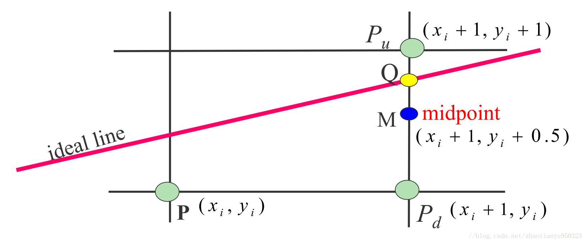
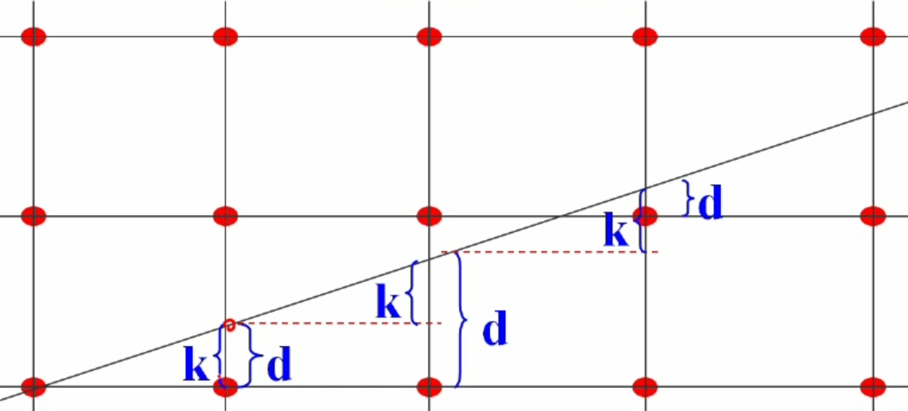

# 直线段光栅化

**别名**: 直线扫描转换算法.  

该部分算法用于将直线段的顶点表示转换为点阵表示, 该过程被称为直线段的"光栅化".  

## 数值微分法(Digital Differential Analyzer, DDA)

### 理论

**思想**: 增量.  
因为光栅的光学器件等宽等间距, 所以在绘制线段的过程中, x 的增量恒为 1. 只要通过直线的斜截式计算出斜率 k, 即可只通过两次浮点数加法(包括四舍五入的)得出下一个点的坐标.  
**公式 1**: y = k * x + b, k = Δy / Δx (直线的斜截式方程)  

### 实现

```cpp
void drawLine(Point2 start, Point2 end)
{
  const float dx = end.x - start.x;
  const float dy = end.y - start.y;
  const float k  = dy / dx;

  float y = start.y;
  for(int x = (int)(start.x + 0.5f); x <= end.x; x++) // 对 x 四舍五入取整.  
  {
    drawPoint(x, (int)(y + 0.5f));
    y += k;
  }
}
```

当线段平行于y轴时, 变量 `dx` 为零, 而零作为除数没有意义. 因此该实现只适用于线段不与y轴平行的情况.  

### 完善

```cpp
void drawLine(Point2 start, Point2 end)
{
  const float dx = end.x - start.x;
  const float dy = end.y - start.y;
  const float dm = std::max(dx, dy);
  const float kx = max / dx;
  const float ky = max / dy;

  float x = start.x, y = start.y;
  for(int i = 0; i < dm; i++)
  {
    drawPoint((int)(x + 0.5f), (int)(y + 0.5f));
    x += kx, y += ky;
  }
}
```

上面的实现效率较低, 但适用于各种情况.  

```cpp
void drawLine(Point2 start, Point2 end)
{
  const float dx = end.x - start.x;
  const float dy = end.y - start.y;
  
  if(std::abs(dx) < std::abs(dy)) // k > 1
  {
    const float k = dx / dy;
    float x = start.x;
    for(int y = (int)(start.y + 0.5f); y <= end.y; y++)
    {
      drawPoint((int)(x + 0.5f), y);
      x += k;
    }
  }
  else if(std::abs(dx) > std::abs(dy)) // k < 1
  {
    const float k = dy / dx;
    float y = start.y;
    for(int x = (int)(start.x + 0.5f); x <= end.x; x++)
    {
      drawPoint(x, (int)(y + 0.5f));
      y += k;
    }
  }
  else // k == 1
  {
    int y = (int)(start.y + 0.5f);
    for(int x = (int)(start.x + 0.5f); x <= end.x; x++)
    {
      drawPoint(x, y);
      y++;
    }
  }
}
```

上面的实现对斜率进行分类讨论, 针对不同情况使用单独的略有不同的实现. 可以通过交换 start 与 end 的 x 和 y 坐标精简代码, 但可能会影响可读性此处没有采用.  

## 中点分割法

### 理论

DDA 绘制一个点平均使用两至三个浮点数加法. 浮点数加法慢与整数加法, 若能使用整数加法替代浮点数加法可以得到更高的性能.  
该算法利用直线的一般式, 完全使用整数加法.  
设 F(x, y) = Ax + By + C, 根据直线的一般式可得:  

- 若点位于直线上方, 则 F(x, y) > 0
- 若点位于直线上, 则 F(x, y) = 0
- 若点位于直线下方, 则 F(x, y) < 0

{ width=60% style="display: block; margin: 0 auto" }  

每次向最大位移方向上累加一个单元, 通过中点误差项判断是否往另一个方向累加一个单元. 若 0 <= |k| <= 1, 即|Δx| > |Δy|, 每次循环时 x 坐标累加 1, y 坐标是否累加 1 取决于线段与 x = x(变量) 交点 Q 的位置, 离点 Pd(x + 1, y) 更近还是点 Pu(x + 1, y + 1). 这将通过把这两点的中点 M 带入 F(x, y) 后判断其正负性. 若 F(x, y) < 0, 则表示中点位于交点 Q 的下方, 即交点 Q 位于中点 M 上方, 更接近于点 (x, y + 1).  
**公式 2**: Ax + By + C = 0, A = -(Δy), B = Δx, C = -B(Δx) (直线的一般式方程)  

### 实现

```cpp
void drawLine(Point2 start, Point2 end)
{
  const auto dx = end.x - start.x;
  const auto dy = end.y - start.y;

  const auto a = -dy, b = dx, c = -b * dx;
  auto f = [a, b, c](int x, int y){ return a * x + b * y + c; };

  int y = (int)(start.y + 0.5f);
  for(int x = (int)(start.x + 0.5f); x <= end.x; x++)
  {
    drawPoint(x, y);
    auto d = f(x + 1, y + 0.5f);
    y += d < 0; // if(d < 0) y++;
  }
}
```

上面实现效率低下, 主要有以下几点可以改进的部分:

- 主要的计算工作在 lambda 函数 f 中, 用以计算 d. 若推导出 d 值的递推公式, 则可以删减这部分计算.  
  - 若上一次计算的 d >= 0, 上一个中点为 0(x, y + 0.5), 下一个中点为 M1(x + 1, y + 0.5) 带入 F 可以看出 A 的系数增加了 1, B 的系数加了 1. 所以 F(M1) - F(M0) = A + B, 即 d1 - d0 = A + B, d1 = d0 + A + B.
  - 若上一次计算的 d < 0, 上一个中点为 M0(x, y + 0.5), 下一个中点为 M1(x + 1, y + 0.5), 带入 F 可以看出 A 的系数增加了 1, B 的系数不变. 所以 F(M1) - F(M0) = A, 即 d1 - d0 = A, d1 = d0 + A.

  由此可知可以通过增量计算出下一个 d 的值, 而不需要每次都将中点带入函数 F 计算. d 的初始值 d0 可以通过以下方式计算.  
  d0 = F(x0 + 1, y0 + 0.5) = F(x0, y0) + A + 0.5B.
  因为 (x0, y0) 为直线起始点, 位于直线上, 所以 F(x0, y0) = 0. 所以 d0 = A + 0.5B.
- 求 d0 以及每次将中点 M 的值代入函数 F 中时, 需要进行一次浮点数加法. 由于 d 只被用于判断其正负性, 所有可以通过乘以2来消除浮点数加法(0.5f * 2 = 1).

综上所述, 可以得到以下面实现.

```cpp
void drawLine(Point2 start, Point2 end)
{
  const auto dx = end.x - start.x;
  const auto dy = end.y - start.y;
  const auto a  = -dy, b = dx;
  int        dd = a + a + b + b; // 2 * d0 = 2 * (A + B)
  
  int y = (int)(start.y + 0.5f)
  for(int x = (int)(start.x + 0.5f); x <= end.x; x++)
  {
    drawPoint(x, y);
    if(dd < 0)
    {
      y++;
      dd += a + a + b + b; // 2 * (A + B)
    }
    else
      dd += a + a; // 2 * A
  }
}
```

不过上面的实现明显并不适用于斜率大于 1 的线段, 因为每次循环 x 累加 1, 却只会调用一次 drawPoint. 如果强行使用这类实现绘制斜率大于 1 的线段, 将会发现绘制出的线段在 y 轴方向上不连续. 若要实现可绘制各种线段的, 可以参考 DDA 部分的解决方案.  

## Bresenham 算法

**背景**: 该算法由 E. Jack Bresenham 提出, 该算法是其最著名的发明.  

### 理论

  
由 Figure-1 可以看出 d 的计算方法为:

```cpp
d += k;
d -= d >= 1; // if(d >= 1) d--;
```
