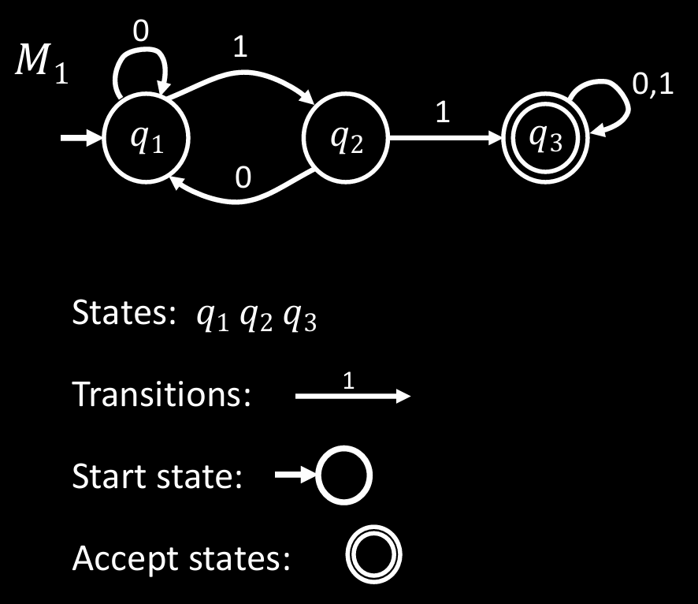

# 确定有限自动机

**英文**: Deterministic finite automata.

**关键字**: 确定有限状态自动机 (DFSA), 确定有限状态机 (DFSM).


计算机十分复杂, 在对其进行计算相关的研究时会采用一种简化的抽象模型, 即*自动机*. \
这种简化是通过剔除计算机中与计算无关的特征来实现的, 最终得到一个用于描述计算机软硬件的计算模型(computational model).

确定有限自动机 (以下简称 DFA) 是一种自动机. 其中, "确定" 和 "有限" 是对该自动机的限制, 其含义如下:

- **确定**: "确定" 是相对于**非确定**而言的. 后续将介绍非确定有限自动机, 届时将说明确定和非确定的含义.
- **有限**: DFA 也被称为确定**有限状态**自动机, 顾名思义, 其中的 "有限" 指**状态的数量有限**.

下面是 DFA $M_1$ 的状态图:

{ width=50% style="display: block; margin: 0 auto" }  

- **输入**: **有限**的字符串.
- **输出**: **接受 (Accept)** 或**拒绝 (Reject)**.
- **计算过程**: 从起始状态开始, 读取输入符号, 进行对应的转移 (Transition), 最终处于接受状态则接受, 否则拒绝. (没有对应的转移则直接拒绝)

以 $M_1$ 为例:

- "01101": 结束状态为 $q_3$, 属于接受状态, 所以接受.
- "00101": 结束状态为 $q_2$, 不属于接受状态, 所以拒绝.

分析后可知, $M_1$ 能接受任意包含子串 "11" 的字符串.  
所有能被机器识别的字符串集合被称为该机器的语言 (language).

$M_1$ 的语言 $A$ 可以表示为:

$$
\begin{align}
A &= \{w \mid w \text{ 包含子串 "11"}\} \\
  &= L(M_1)
\end{align}
$$

关于自动机的问题:

- 该机器的语言是什么?
- 接受该语言的机器是什么?

## 定义

一个有限自动机 $M$ 是一个五元组 $(Q, \Sigma, \delta, q_0, F)$, 其中:

- $Q$ 是**状态 (state)** 的有限集.
- $\Sigma$ 是由**字母表 (alphabet)** 符号组成的有限集.
- $\delta: Q \times \Sigma \rightarrow Q$ 是**转移函数**.
- $q_0 \in Q$ 是**初始状态**.
- $F \subseteq Q$ 是**接受状态 (accepting states)** 的集合.

此处的字母表是形式语言的术语, 而非拉丁字母表.  
用上述符号可以将 $M_1$ 表示为:

$$
\begin{align}

   M_1 &= (Q, \Sigma, \delta, q_0, F) \\
     Q &= \{q_1, q_2, q_3\} \\
\Sigma &= \{0, 1\} \\
   q_0 &= q_1 \\
     F &= \{q_3\} \\
\delta &=
\begin{array}{c|ccc}
    & \textbf{0} & \textbf{1} \\ \hline
    q_1 & q_1 & q_2 \\
    q_2 & q_1 & q_3 \\
    q_3 & q_3 & q_3
\end{array}

\end{align}
$$

## 计算过程

- **字母表**: 由符号构成的有限集.
- **字符串 (string)**: 由 $\Sigma$ 中符号构成的有限序列.
- **语言**: 字符串的集合 (有限或无限).
- **空字符串**: 长度为 0 的字符串, 写作 $\varepsilon$.
- **空语言**: 不包含任何字符串的集合, 即空集. 写作 $\emptyset$.

$M$ 接受字符串 $w = w_1w_2 ... w_3, \text{ each } w_i \in \Sigma$,
如果存在状态序列: $r_0, r_1, ..., r_n, r_i \in Q$, 满足以下条件:

- $r_0 = q_0$.
- $r_i = \delta(r_{i-1}, w_i) \text{ for } 1 \leq i \leq n$.
- $r_n \in F$.

## 代码实现

DFA $M_1$ 的 Rust 代码实现为:

```rust
#[derive(PartialEq)]
enum State {
    Q1,
    Q2,
    Q3,
}

enum Alphabet {
    Zero,
    One,
}

fn dfa(input: &[Alphabet]) -> bool {
    let mut state = State::Q1;
    for symbol in input {
        state = delta(state, symbol);
    }
    state == State::Q3
}

fn delta(state: State, symbol: &Alphabet) -> State {
    match (state, symbol) {
        (State::Q1, Alphabet::Zero) => State::Q1,
        (State::Q1, Alphabet::One) => State::Q2,
        (State::Q2, Alphabet::Zero) => State::Q1,
        (State::Q2, Alphabet::One) => State::Q3,
        (State::Q3, _) => State::Q3,
    }
}

fn main() {
    assert!(dfa(&[
        Alphabet::Zero,
        Alphabet::One,
        Alphabet::One,
        Alphabet::Zero,
        Alphabet::One
    ]));
    assert!(!dfa(&[
        Alphabet::Zero,
        Alphabet::Zero,
        Alphabet::One,
        Alphabet::Zero,
        Alphabet::One
    ]));
}
```
