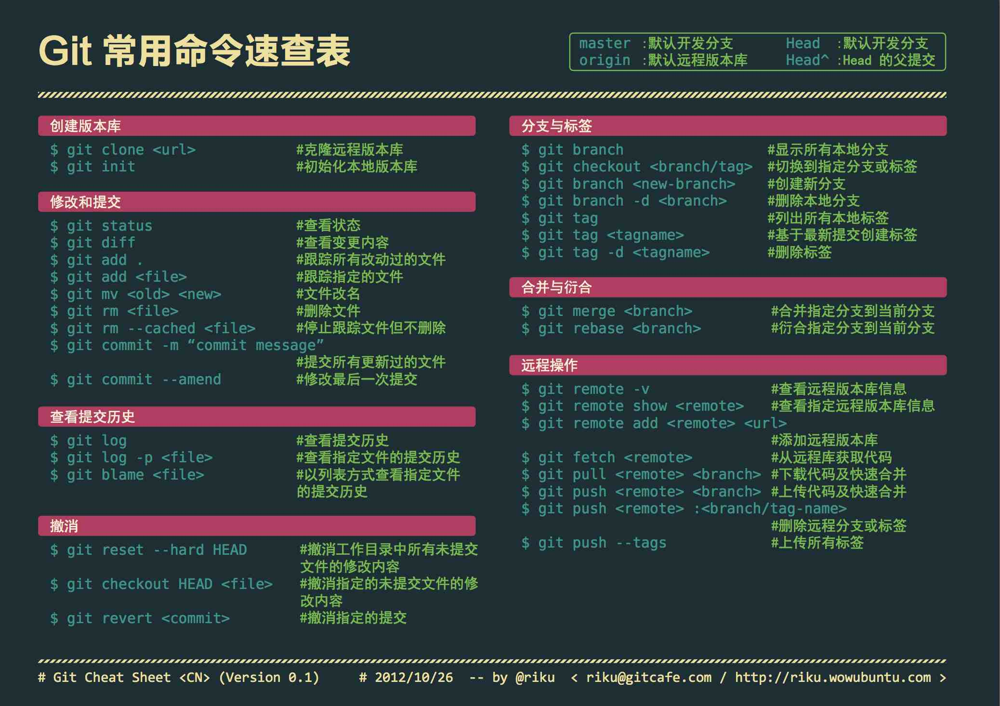
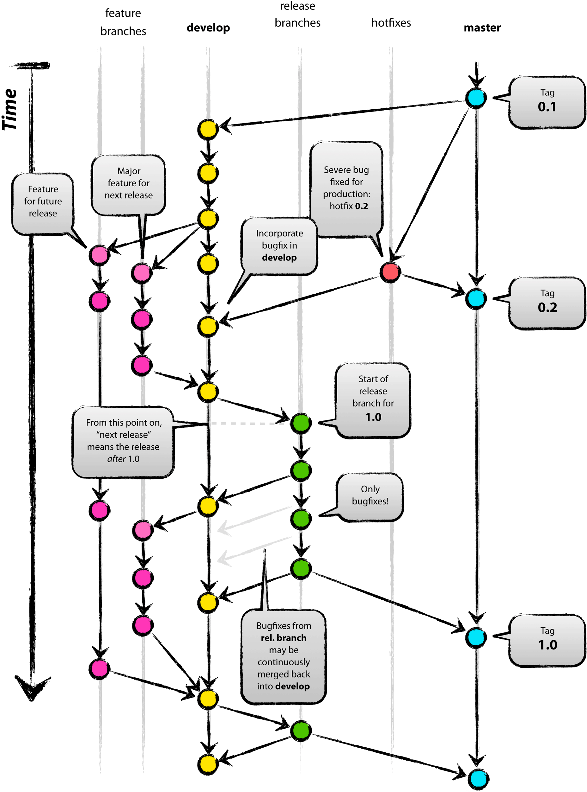

# Git

## 基本命令



## 工作流程(Workflow)

分支:

- main: 包含生产代码.
- develop.
- release/xxx.
- feature/xxx.
- hotfix/xxx.


## 清空仓库

```bash
git clone https://github.com/<ACCOUNT>/<REPO>.wiki.git
cd <REPO>.wiki
git checkout --orphan empty # 创建孤儿分支 empty
git rm --cached -r .
git commit --allow-empty -m 'first commit'
git push origin empty:master --force
```

## GUI 客户端

- [Github Desktop](https://desktop.github.com/): 简洁.
- [GitKraken](https://www.gitkraken.com/): 跨平台, 部分功能收费.

**注意**: 如果已为 Git 配置了代理服务器不建议使用 `GitKraken`, 可能会导致错误.

## Github CLI

Github CLI 是 Github 官方提供的跨平台的命令行工具.
https://github.com/cli/cli#installation
Windows 用户可以直接从 [Releases](https://github.com/cli/cli/releases) 上下载安装包.
安装后执行下面命令, 来登录账户并配置本地的 Git.
在 Github 因为安全问题禁用 Git 通过账户和密码登录后, 经过 Github CLI 配置后的 Git 可以按原样使用.

```bash
sudo pacman -S gh # Archlinux
gh auth login     # 登录 Github 账号
gh auth setup-git # 配置 Git
```

## 配置 Git

**注意**: 可以通过安装 Github CLI 来实现自动配置.

### 设置用戶

```bash
git config --global user.name 'name'
git config --global user.email 'eamil'
```

### 设置编辑器

```bash
git config --global core.editor 'vim'
```

### 设置代理

```bash
git config --global http.proxy 'socks5://127.0.0.1:7891'
git config --global https.proxy 'socks5://127.0.0.1:7891'
```

## 拓展

- [入门视频](https://www.bilibili.com/video/BV1KD4y1S7FL)
- [进阶视频](https://www.bilibili.com/video/BV1hA411v7qX)
