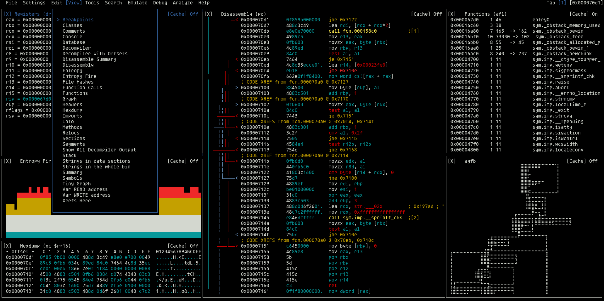

# 反汇编器

- IDA Pro: 跨平台, 天价.
- [Radare2](https://github.com/radareorg/radare2): 免费, 开源, 命令行.
- [Ghidra](https://github.com/NationalSecurityAgency/ghidra): 免费, 开源, 跨平台.
- GDB: 调试器, 但具有反汇编的功能.

GDB 可以对代码进行反汇编, 但只是简单的输出反汇编代码. 可以搭配 Radare2 使用, 同时具备动态调试和反汇编功能.  

## Radare2

  

安装:

```bash
git clone https://github.com/radareorg/radare2
cd radare2 ; sys/install.sh
```

[iaito](https://github.com/radareorg/iaito) 为 Radare2 提供了一个 QT GUI.

1. 启动

    ```bash
    r2 [程序名称]
    r2 -d [程序名称] # 如果想对程序进行调试需添加 -d 选项
    ```

    之后便进入 radar2 内部的命令行.  

2. 分析

    ```bash
    > aaa      # 对全部函数进行分析
    > afl      # 查看分析的函数
    > afl~main # 查看包含特定关键字的函数
    ```

3. 反编译

    ```bash
    > s main # 定位到指定函数
    > pdf    # 输出反编译结果
    ```

4. 视觉模式

    ```bash
    V  # 进入视觉模式
    VV # 进入图表模式
    ```

    进入视觉模式后可以按 `p` 进行切换, 按 `V` 进入图表模式.  

5. 调试

    | 按键 | 描述     |
    | ---- | -------- |
    | F2   | 设置断点 |
    | F7   | 单步步入 |
    | F8   | 单步步过 |
    | F9   | 执行     |

    ```bash
    > iz             # 输出字符串
    > pf @ [变量名]   # 输出变量的值
    > pf z @ [变量名] # 输出 null-terminated 字符串变量的值
    ```
