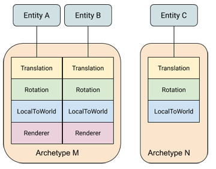

# ECS

**英文**: Entity-Component-System(ECS).  

## 概述

相對於使用面向對象的繼承, ECS 有一下幾個優點:

- 模块化: ECS 可以增加代码重用, 避免代码体积迅速膨胀.
- 避免继承带来的缺陷: 相比传统的继承, ECS 不用担心"菱形继承", 继承关系复杂等问题.
- 高性能: 数据以组件的形式添加, 内存管理自由, 可以有效利用数据局部性原理(Cache 友好).

ECS 由實體(entity), 組件(components)和系統(system)三部分組成, 分別對應標識, 數據和行为. 它們之間的具體關係如下圖所示:

  

## 实体(Entity)

实体只作为标识, 可向其添加和移除组件. 但实体本身并不包含组件的数据, 类似指向了组件数据的指针.  
下面是一个实体的简单实现:

```cpp
struct Entity
{
  using id_type      = uint32_t;
  using version_type = uint32_t;

  id_type      id;      // ID
  version_type version; // 版本
}
```

### ID

是实体作为标识的具体实现方法, 存放了一个唯一的 ID. 实体销毁后 ID 会被回收, 并将在后续创建的新实体中继续使用. 这意味着分发实体的类需要维护一个以回收的 ID 表.

### 版本(Version)

因为实体只是一个标识, 所以在内存中可能存在多个副本. 且实体销毁后所使用的 ID 会被重新利用. 为了判断一个实体是否有效, 引入了第二个属性版本.  
ID 会重複利用, 因此无法通过 ID 判断当前实体是否已被销毁. 每次销毁版本都增加 1, 以确保已销毁的实体的版本过时, 可以查询最新 ID 的版本来判断实体是否无效. 这意味着分发实体的类需要维护一个包含 ID 和最新版本的表.

## 组件(Component)

组件用于存储数据.  
下面是一个具体组件的简单实现:

```cpp
struct TransformComponent
{
  Vector3    position;
  Quaternion rotation;
  Vector3    scale;
};
```

### Archetypes

一种独特的组件类型组合被称为一个 Archetype. 如下图, 可以通过组件类型的组合分为 M, N 两种 Archetype. 对组件类型的改动也会造成实体 Archetype 的改变. 例如, 移除实体B的 Renderer 组件会使其的 Archetype 从 M 变为 N.  

  

Archetype 可以看作是组件种类的合集, 因此可以用 `std::bitset` 来存储这些数据来方便的实现快速的交并集运算.  
每个组件对应一个位, 位的状态表示是否包含该组件. 通常会使用下列几种运算:  

- any: a 是否包含 b 的任意一个组件, 即 a 与 b 之间是否存在交集. 只需要判断 `a & b` 是否为 ture.
- all: a 是否包含 b 的全部组件, 即是 a 是否是 b 的子集. 只需要判断 `a & b` 是否与 b 相等.
- none: a 是否没有包含 b 的任何组件, a 与 b 之间没有交集. 只需要判断 `a & b` 是否为 false.

```cpp
struct Archetype
{
  bool anyOf(const Archetype&) const {...};
  bool allOf(const Archetype&) const {...};
  bool noneOf(const Archetype&) const {...};

  std::bitset<32> signature;
};
```

---

## Unity ECS

### 内存块(Memory Chunks)

实体组件的存储位置取决于其 Archetype. ECS 申请的内存块被简称为 chunk. 每个 chunk 只会存储相同 Archetype 的实体.  
  

## 拓展

- <https://austinmorlan.com/posts/entity_component_system/>
- <https://wickedengine.net/2019/09/29/entity-component-system/>

## 参考

- [Unity ECS](https://docs.unity3d.com/Packages/com.unity.entities@0.10/manual/ecs_core.html)
