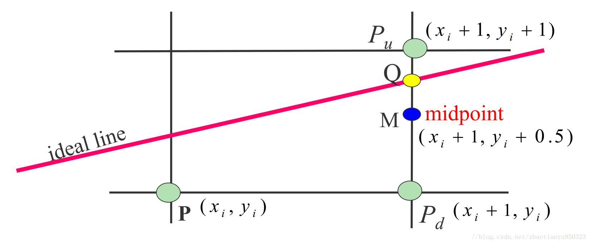

# 光栅图形学

**警告**: 下面全部实现均未经过测试, 仅供参考.

## 直线扫描转换算法

### 数值微分法(Digital Differential Analyzer, DDA)
因为光栅的光学器件等宽等间距, 所以在绘制线段的过程中, x 的增量恒为 1. 只要通过直线的斜截式计算出斜率 k, 即可只通过两次浮点数加法(包括四舍五入的)得出下一个点的坐标.  
**公式**: y = k * x + b, k = Δy / Δx  
```cpp
void drawLine(Point2 start, Point2 end)
{
  const float dx = end.x - start.x;
  const float dy = end.y - start.y;
  const float k  = dy / dx;

  float y = start.y;
  for(int x = (int)(start.x + 0.5f); x <= end.x; x++)
  {
    drawPoint(x, (int)(y + 0.5f));
    y += k;
  }
}
```
根据上面的实现, 当线段平行于y轴时, `end.x - start.x` 为零, 而零作为除数没有意义. 因此该实现并不适用于所有情况.  
```cpp
void drawLine(Point2 start, Point2 end)
{
  const float dx  = end.x - start.x;
  const float dy  = end.y - start.y;
  const float max = std::max(dx, dy);
  const float kx  = max / dx;
  const float ky  = max / dy;

  float x = start.x, y = start.y;
  for(int i = 0; i <= max; i++)
  {
    drawPoint((int)(x + 0.5f), (int)(y + 0.5f));
    x += kx, y += ky;
  }
}
```
上面的实现效率较低, 但适用于各种情况. 
```cpp
void drawLine(Point2 start, Point2 end)
{
  const float dx  = end.x - start.x;
  const float dy  = end.y - start.y;
  
  if(std::abs(dx) < std::abs(dy)) // k > 1
  {
    const float k = dx / dy;
    float x = start.x;
    for(int y = (int)(start.y + 0.5f); y <= end.y; y++)
    {
      drawPoint((int)(x + 0.5f), y);
      x += k;
    }
  }
  else if(std::abs(dx) > std::abs(dy)) // k < 1
  {
    const float k = dy / dx;
    float y = start.y;
    for(int x = (int)(start.x + 0.5f); x <= end.x; x++)
    {
      drawPoint(x, (int)(y + 0.5f));
      y += k;
    }
  }
  else // k == 1
  {
    int y = (int)(start.y + 0.5f);
    for(int x = (int)(start.x + 0.5f); x <= end.x; x++)
    {
      drawPoint(x, y);
      y++;
    }
  }
}
```
上面的实现对斜率进行分类讨论, 针对不同情况使用单独的略有不同的实现. 可以通过交换 start 与 end 的 x 和 y 坐标精简代码, 但可能会影响可读性此处没有采用.  

### 中点分割法
DDA 绘制一个点平均使用两至三个浮点数加法. 浮点数加法慢与整数加法, 若能使用整数加法替代浮点数加法可以得到更高的性能.  
该算法利用直线的一般式, 完全使用整数加法.  
设 F(x, y) = Ax + By + C, 根据直线的一般式可得:
- 若点位于直线上方, 则 F(x, y) > 0
- 若点位于直线上, 则 F(x, y) = 0
- 若点位于直线下方, 则 F(x, y) < 0

每次向最大位移方向上累加一个单元, 通过中点误差项判断是否往另一个方向累加一个单元. 若 0 <= |k| <= 1, 即|Δx| > |Δy|, 每次循环时 x 坐标累加 1, y 坐标是否累加 1 取决于线段与 x = x(变量) 交点 Q 的位置, 离点 Pd(x + 1, y) 更近还是点 Pu(x + 1, y + 1). 这将通过把这两点的中点 M 带入 F(x, y) 后判断其正负性. 若 F(x, y) < 0, 则表示中点位于交点 Q 的下方, 即交点 Q 位于中点 M 上方, 更接近于点 (x, y + 1).  
  
**公式**: Ax + By + C = 0, A = -(Δy), B = Δx, C = -B(Δx)  
```cpp
void drawLine(Point2 start, Point2 end)
{
  const auto dx = end.x - start.x;
  const auto dy = end.y - start.y;

  const auto a = -dy, b = dx, c = -b * dx;
  auto f = [a, b, c](int x, int y){ return a * x + b * y + c; };

  int y = (int)(start.y + 0.5f)
  for(int x = (int)(start.x + 0.5f); x <= end.x; x++)
  {
    drawPoint(x, y);
    auto d = f(x + 1, y + 0.5f);
    y += d < 0;
  }
}
```
上面实现效率低下, 主要有一下几点可以改进的部分:
- 主要的计算工作在 lambda 函数 f 中, 用以计算 d. 若推导出 d 值的递推公式, 则可以删减这部分计算.  
  - 若上一次计算的 d >= 0, 上一个中点为 0(x, y + 0.5), 下一个中点为 M1(x + 1, y + 0.5) 带入 F 可以看出 A 的系数增加了 1, B 的系数加了 1. 所以 F(M1) - F(M0) = A + B, 即 d1 - d0 = A + B, d1 = d0 + A + B.
  - 若上一次计算的 d < 0, 上一个中点为 M0(x, y + 0.5), 下一个中点为 M1(x + 1, y + 0.5), 带入 F 可以看出 A 的系数增加了 1, B 的系数不变. 所以 F(M1) - F(M0) = A, 即 d1 - d0 = A, d1 = d0 + A.

  由此可知可以通过增量计算出下一个 d 的值, 而不需要每次都将中点带入函数 F 计算. d 的初始值 d0 可以通过以下方式计算.  
  d0 = F(x0 + 1, y0 + 0.5) = F(x0, y0) + A + 0.5B.
  因为 (x0, y0) 为直线起始点, 位于直线上, 所以 F(x0, y0) = 0. 所以 d0 = A + 0.5B.
- 求 d0 以及每次将中点 M 的值代入函数 F 中时, 需要进行一次浮点数加法. 由于 d 只被用于判断其正负性, 所有可以通过乘以2来消除浮点数加法(0.5f * 2 = 1).

综上所述, 可以得到以下面实现.
```cpp
void drawLine(Point2 start, Point2 end)
{
  const auto dx = end.x - start.x;
  const auto dy = end.y - start.y;
  const auto a  = -dy, b = dx;
  int        dd = 2 * a + b; // d0 * 2
  
  int y = (int)(start.y + 0.5f)
  for(int x = (int)(start.x + 0.5f); x <= end.x; x++)
  {
    drawPoint(x, y);
    if(dd < 0)
    {
      y++;
      dd += a + b;
    }
    else
      dd += a;
  }
}
```
不过上面的实现明显并不适用于斜率大于 1 的线段, 因为每次循环 x 累加 1, 却只会调用一次 drawPoint. 如果强行使用这类实现绘制斜率大于 1 的线段, 将会发现绘制出的线段在 y 轴方向上不连续.  

### Bresenham

## 多边形扫描转换算法
该算法的主要功能的将多边形的顶点表示转换成点阵表示, 以实现多边形的光栅化.  
多边形可分为下面几类:
- 凸多边形: 任意两点间连线均在多边形内.
- 凹多边形: 任意两点间连线均有不在多边形内.
- 含内环的多边形: 多边形内包含多边形.

### X-扫描线
以一条平行与光栅网格的扫描线, 逐步从多边形任意一个轴的最大值扫描到最小值. 求出所有与多边形线段相交的顶点, 进而得出扫描线与多边形相交的区间. 最后填充这些区间.  
假设扫描线与x轴平行, 大致可分为一下几个步骤:
1. 确定扫描范围: 多边形顶点y的最大值和y的最小值.
2. 扫描.  
  a. 求交: 获取扫描线与多边形各边的交点.  
  b. 排序: 将这些交点按x坐标升序排列.  
  c. 配对: 第一个交点与第二个交点配对形成一个相交区间, 第三个交点和第四个交点配对形成一个相交区间, 以此类推.  
  d. 填色: 填充这些相交区间.  

若扫描线与多边形顶点相交, 为确保顶点正常匹配, 需要保证顶点个数为偶数. 若共享顶点的两条边分别落在扫描线的两侧时, 算作一个交点; 两条边都位于扫描线上方时, 算作两个交点; 两条边都位于下方时, 算作零个顶点. 即共享顶点两条边位于扫描线上方的个数即为应该判定的交点个数.  

**想法**: 可不可以通过直线扫描转换算法计算出所有的点, 然后同一 y 坐标的点根据 x 坐标排序.  

## 区域填充算法
将区域内的一点(种子点)予以指定的颜色, 然后将这种颜色扩展到整个区域内. 该算法作用于以点阵方式表示的图形. 类似 Windows 画图的 '颜料桶' 功能.  
区域可分为四向连通区域和八向连通区域. 四向包含了上/下/左/右四个方向, 而八向在四向的基础上还包含了左上/右上/左下/右下共八个方向. 四向连通区域是指从该区域的仍以一点出发, 可通过四个方向移动的组合, 到达区域内的任意一点, 八向连通区域类似.  

### 递归算法
类似深度优先搜索(Depth First Search, DFS)算法, 因为实现过于简单不予进一步说明.  
简而言之, 算法简单, 效率低下(占空间, 耗时间).  

### 扫描线算法

## 反走样(Antialiasing)
走样(aliasing)是光栅显示的一种固有性质. 产生的原因是像素本质上的离散性, 因此走样是无法避免的. 走样产生的现象主要有:  
- 图形产生锯齿状边缘.
- 相对微小的物体容易在静态图形中被丢弃.
- 在动画序列中图像产生闪烁, 时隐时现.

通过"模糊"边界之间的颜色变换, 可以使得锯齿状的边界不那么明显, 看上去更加平滑. 具体的实现有以下两种方法:  
- 非加权区域采样方法  
  根据覆盖度(coverage)计算像素的颜色, 覆盖率指某个像素区域被物体覆盖的比例. 但由于每次只考虑一个像素区域所以效果有限.
- 加权区域采样方法  
  影响到多个像素区域, 因此效果更佳.

## 裁剪算法

## 消隐算法
