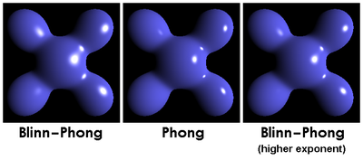

# 光照模型

为表达自然光照效果, 需要根据光学物理的有关定律建立一个数学模型, 计算物体表面任意一点投向观察者(viewer)的光线亮度. 该数学模型被称为光照模型(illumination Model).

## 局部光照模型



### Blinn-Phong Reflectance Model

```
物体表面反光 = 环境光(ambient lighting) + 漫反射光(diffuse reflection) + 镜面反射高亮(specular highlights)
```
1. 环境光:   是指光源间接对物体的影响, 是在物体和环境之间多次反射, 最终达到平衡时一种光.
2. 漫反射:   入射光线射到粗糙的表面时, 粗糙的表面将光线向着各个方向反射的现象.

分别计算三种光照的效果最后求和得到结果. 使用点积计算向量之间的夹角. 使用 [Lambert's cosine law] 计算光线总量.

```c++
// 平行光
struct Light
{
  vec3 direction;
  vec3 color;
};

/**
  * @brief 计算平行光光照.
  *
  * @param Light   入射光属性.
  * @param cam_dir 相机观察方向.
  * @param normal  表面法向量.
  */
vec3 CalcLight(Light light, vec3 cam_dir, vec3 normal)
{
  const float ka = 0.2; // 环境光系数
  const float kd = 0.5; // 漫反射系数
  const float ks = 0.7; // 镜面反射系数
  const float shininess = 32.0;

  const vec3 dir_to_light = -light.direction;
  const vec3 dir_to_cam   = -cam_dir;

  // 环境光照
  vec3 ambient = ka * light.color;

  // 漫反射光照
  float diffuse_amount = max(dot(dir_to_light, normal), 0.0); // 计算参与漫反射的光线总量
  vec3  diffuse        = kd * light.color * diffuse_amount;

  // 镜面反射光照
  vec3  reflected_dir   = reflect(dir_to_light, normal);                                       // 计算反射光线方向
  float specular_amount = pow(max(dot(reflected_dir, dir_to_cam), 0.0), u_material.shininess); // 计算参与镜面反射的光线总量
  vec3  specular        = ks * light.color * specular_amount;

  return ambient + diffuse + specular;
}
```

## 整体光照模型


[lambert's cosine law]: https://en.wikipedia.org/wiki/Lambert%27s_cosine_law
